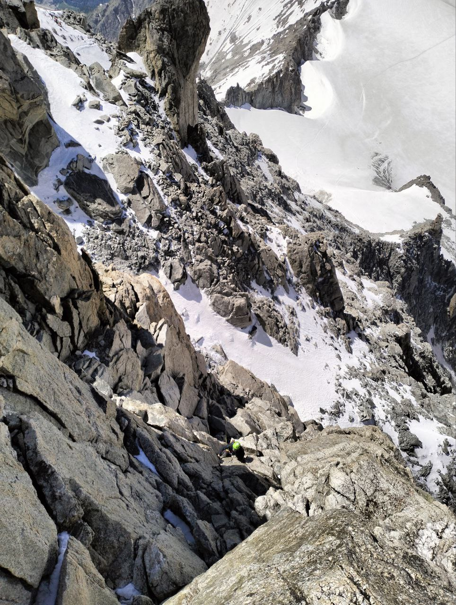
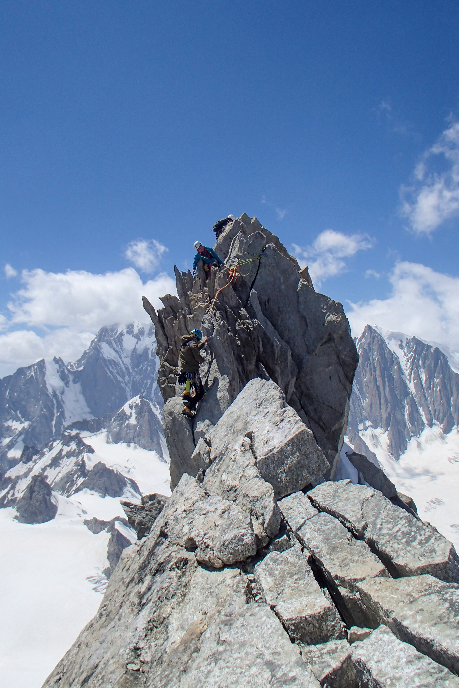
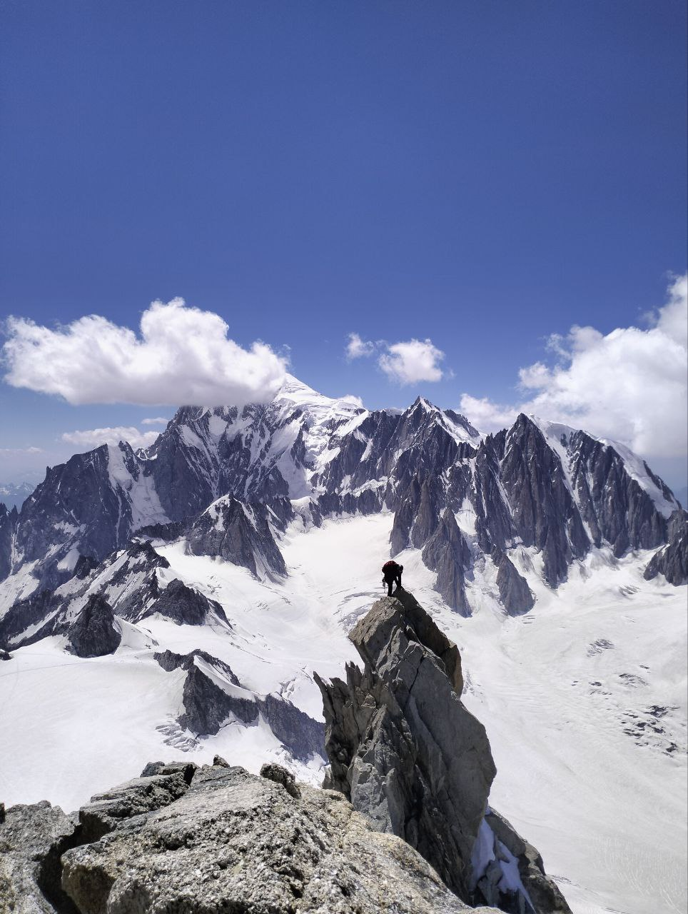
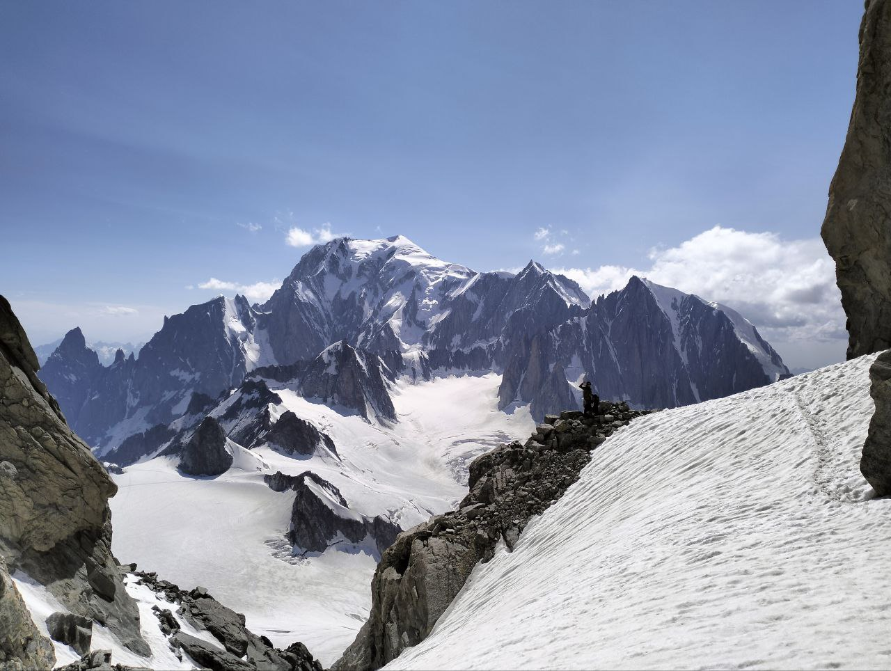

---

That granite monolite that guards the Monte Bianco's glacier. It's just too beautiful not to climb it.

 
Along the trail on the glacier, up in the culoir and through the sketchy mountain base.
But here we are, finally rock climbing.

 
 

Me downclimbing from the first peak of the Dente, while Gio gives me hints.

 
 

The summit.

 
 

Me and the Monte Bianco in the back

 
 

See you soon...

