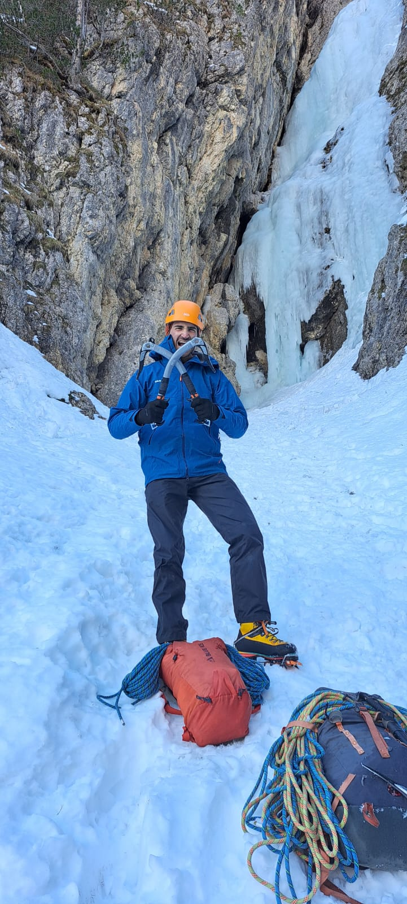
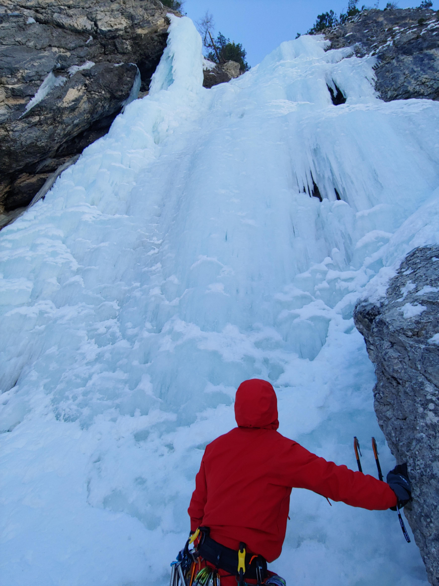
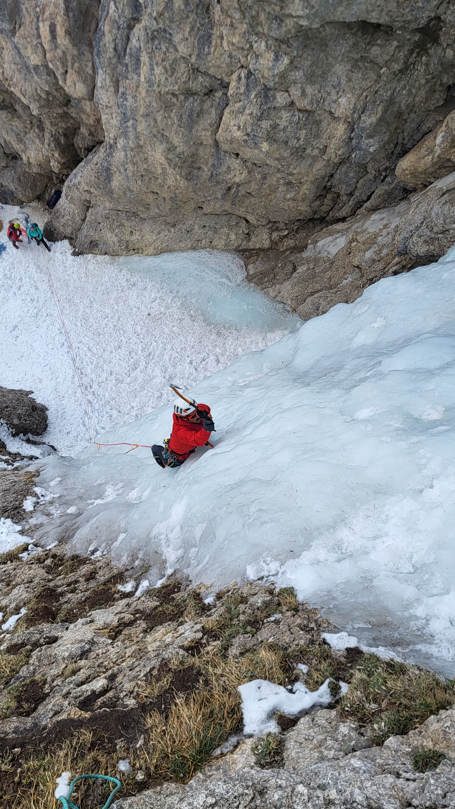
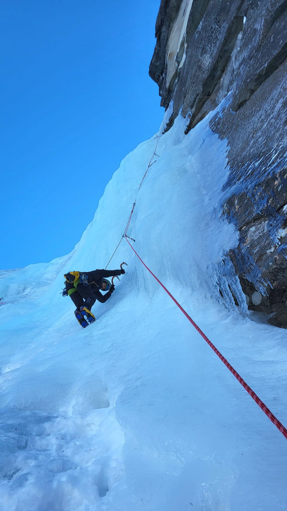

---

Last year me and Francesco got the ice-sickness.

And we went many times up in the Dolomites to admire such ephemeral construction of mother nature that are the ice waterfalls.

And of course climb them:

We went up ``Ursprung``

``Swords of Damocles`` and ``Lujanta``:

Ice climbing is tough: you end up climbing dangerous ephemeral formations in the freezing cold of north walls in winter, where falling would result almost always in a serious injury.

And yet is one of my favourite activities. The charm of such water formations and the feeling of reward you get from climbing them is just incredible.

Thanks to Mauro, great friend who tought us the proper ice climbing technique.

See you soon ...

