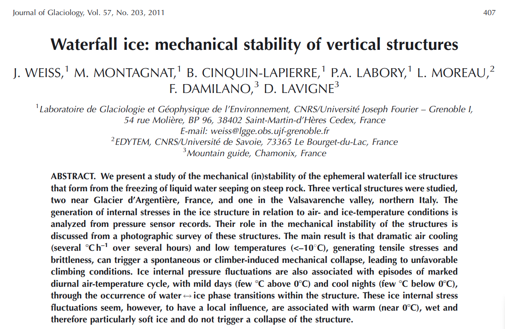
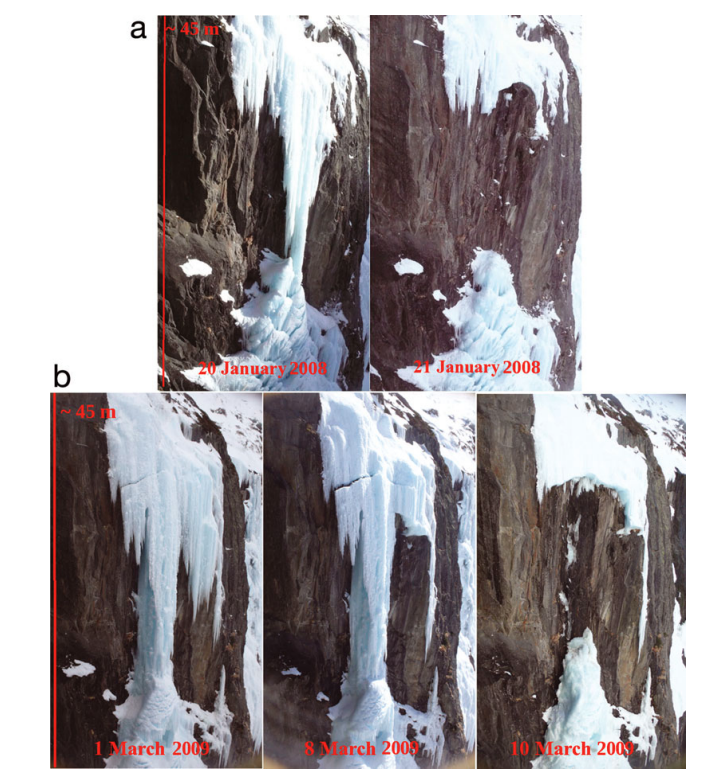

---

As we are deep in the winter season, and Ice climbing is my weekend activity, I started getting curious in putting in numbers the concepts I've learned in the mountains. [This article](https://www.cambridge.org/core/journals/journal-of-glaciology/article/waterfall-ice-mechanical-stability-of-vertical-structures/BA97B8E2B265C97A5EE9531506CE4F58) was the right reading for me.

 

# Waterfall Ice: The (In)Stability of Vertical Structures

[This article](https://www.cambridge.org/core/journals/journal-of-glaciology/article/waterfall-ice-mechanical-stability-of-vertical-structures/BA97B8E2B265C97A5EE9531506CE4F58) deals with the mechanical stability of waterfall ice structures, focusing on vertical formations like **stalactites, free standings, and ice columns**.  The research was conducted in the European Alps, where temperatures below -20°C are rare. 

## Sources of Stress in Waterfall Ice

* **Weight of the ice:**  This mainly affects hanging stalactites, creating tensile stress near the top. Calculations show that the weight of the ice or a climber is unlikely to cause a collapse.  However, a climber's impact with an ice axe could initiate cracks, leading to instability, especially in free standings under tensile stress.
* **Thermal stresses:** Temperature fluctuations, especially rapid cooling, generate significant tensile stresses in the ice. A sudden temperature drop can create tensile stresses exceeding the ice's strength, making it prone to fracture. This is particularly crucial for free standings.
* **Water-ice phase transitions:**  Water freezing within the ice structure's channels can generate localized stresses. While these stresses can be substantial, they are usually limited to specific areas and unlikely to cause large-scale instability.

## Field Observations and Measurements

Researchers studied two frozen waterfalls near Glacier d'Argentière, France – ‘Nuit Blanche’ and ‘Shiva Lingam’ – and one in the Valsavarenche valley, Italy. They used pressure sensors embedded in the ice to measure internal pressure and temperature, and automatic cameras to monitor the structures' evolution.

## Key Findings

* **Dramatic cooling events** (e.g., a 10°C drop in 24 hours or less) cause a sudden drop in ice pressure, indicating the development of tensile stresses. These stresses can lead to crack formation and even the collapse of the structure, as observed in the case of ‘Shiva Lingam’.
* **The rate of cooling matters:**  While a significant temperature drop is crucial for crack initiation, the speed of cooling also plays a role.  Slow cooling allows the ice to relax and reduces the risk of fracture.
* **Water-ice phase transitions** cause significant pressure fluctuations, especially during periods with mild days and cool nights. However, these fluctuations seem localized and do not generally trigger large-scale instability, possibly because warm, wet ice is more ductile.

 

## Implications for Ice Climbing

* **Prolonged warm weather**  (above 0°C) can destabilize any type of waterfall ice structure, including those on rock slabs.
* **Mild days and cool nights**, while causing pressure fluctuations, are less critical for climbers than periods of rapid cooling.
* **Dramatic air cooling**  and cold temperatures are dangerous conditions, particularly for free-standing structures. This is because the rapid cooling generates significant tensile stresses, increasing the risk of collapse.  Cold ice is also more brittle, making it more susceptible to crack propagation from a climber's ice axe.

## Conclusion

This study sheds light on the factors influencing the stability of waterfall ice structures, particularly emphasizing the role of temperature fluctuations and the rate of cooling. While further research is needed, these findings provide valuable insights for ice climbers and highlight the importance of considering temperature conditions when assessing the stability of waterfall ice. 

