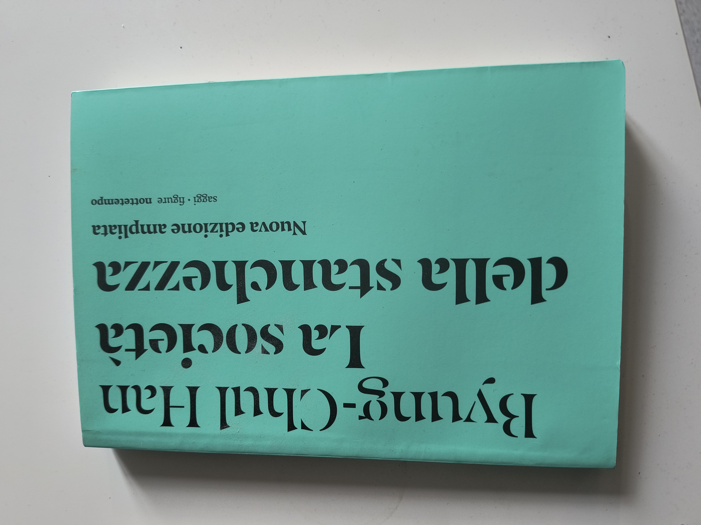

---
Byung-Chul Han’s *The Burnout Society* (*Müdigkeitsgesellschaft*) explores the pressures of contemporary society, particularly in late-stage capitalist and neoliberal contexts, that lead to widespread burnout and exhaustion. He argues that we live in a society dominated by a culture of performance, productivity, and self-optimization, which has replaced the earlier disciplinary society that Michel Foucault described.

 
 

Key ideas from Han's work:

1. **The Shift from Discipline to Achievement**: Han contrasts the disciplinary society of the 19th and early 20th centuries, where people were controlled by external rules and norms (schools, factories, institutions), with today's achievement society. Now, individuals are their own taskmasters, constantly pushing themselves to be more productive, successful, and self-optimized, creating internal pressures rather than external constraints.

2. **Positive vs. Negative Power**: Instead of being oppressed by a "no-saying" system of discipline, modern individuals face a "yes-saying" world of boundless possibilities. We are encouraged to think we can achieve anything if we work hard enough, which Han argues is an illusion that leads to burnout. The oppressive force in today’s society is not restriction but overachievement, resulting in self-exploitation.

3. **Psychological and Physical Effects**: The constant push to achieve more and optimize oneself leads to fatigue, anxiety, depression, and burnout. Han notes that diseases like depression, ADHD, and burnout are emblematic of our age, emerging from the pressure to always be "on" and successful. Instead of clear external oppression, people internalize these pressures and overwork themselves.

4. **Multitasking and Hyperactivity**: Han criticizes how the achievement society encourages multitasking and constant connectivity, which fragments attention and depletes mental resources. This creates a state of hyperactivity but superficial engagement, where deeper, meaningful experiences and contemplative thought are lost.

5. **The Loss of Contemplation and Boredom**: Han argues that in constantly striving for productivity, people lose the ability to experience boredom or engage in deep, reflective thought. Boredom and contemplation are necessary for creativity and self-realization, but the modern world, with its focus on hyperactivity, denies this.

6. **The Individual as an Entrepreneur of the Self**: People are expected to treat their lives like a project, constantly working on improving themselves as though they are a product or business. This "entrepreneurial" attitude toward the self is, in Han's view, deeply alienating and unsustainable, leading to exhaustion and a sense of meaninglessness.

In summary, *The Burnout Society* critiques how modern life demands endless performance and productivity, turning people into self-exploiting machines. Han warns that this culture of achievement is unsustainable, leading to widespread mental health issues and a loss of meaning in life.

 
 
I really enjoyed this book.
I’m really glad that when I asked my friend Pietro aka 'il Vecio' for a suggestion, he recommended The Burnout Society.

I was at his house complaining about the latest book I read back then, which was a rather boring Victorian novel, and asked him to suggest an easy-read low-commitment novel to read. 
He suggested me this philosophical essay from a South Korean-German cultural theorist...
I was like, 'What the hell, Pietro, are you even listening to me?!'. 
Now I'm just glad he, maybe, did not.
Thanks again Vecio.
 
 
See you soon ...