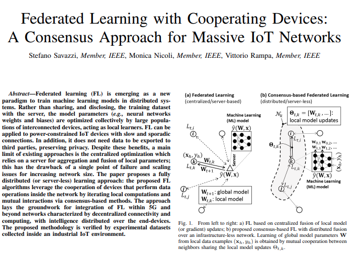

---

I pretty randomly looked into my former Telecommunication Professor's Google Scholar and unexpectedly found [this paper](https://arxiv.org/abs/1912.13163). I guess knowledge is always intertwined.

 

### Federated Learning Overview

Federated Learning (FL) is emerging as a novel approach for training machine learning models in distributed systems. Instead of sharing the training dataset with a central server, model parameters—such as neural network weights and biases—are collectively optimized by a large network of interconnected devices, each functioning as a local learner. This method is particularly beneficial for power-constrained IoT devices with slow and intermittent connections. Additionally, FL maintains privacy by eliminating the need to export data to third parties.

However, existing FL approaches face limitations due to centralized optimization, which depends on a server for aggregating and fusing local parameters. This reliance creates a single point of failure and poses scalability challenges as the network size increases.

### Decentralization in Federated Learning

To address these issues, the paper introduces a fully distributed, server-less learning approach. The proposed FL algorithms utilize the collaboration of devices that conduct data operations within the network, iterating through local computations and mutual interactions via consensus-based methods. This decentralized structure mitigates the risks associated with central servers, enabling devices to work cooperatively and efficiently. 

Decentralization also enhances the resilience of the learning process, as each device can contribute to the model without the need for a central authority. This approach lays the foundation for integrating FL into 5G and future networks, characterized by decentralized connectivity and computing, with intelligence distributed across end devices. The methodology is validated through experimental datasets gathered in an industrial IoT environment.

### A Side Comment

I find always incredibly interesting to look at how the very same problem is tackled in a different manner by different specialists.

Indeed, a Telecom Engineer will most likely have a different background and different view on a problem than a Biologist for example.
Nevertheless, studying the same problem from different perspectives enriches the description and makes the problem clearer.
At least, for me...

 
 
Now I'm asking myself if the algorithms they implemented are Byzantin-Fault Tolerant?

Guess I've looked into too many Blockchain's whitepapers lately...

But what happens if one of those IoT devices turns rouge? 

After all, The butler did it!
 
 

See you soon ...

